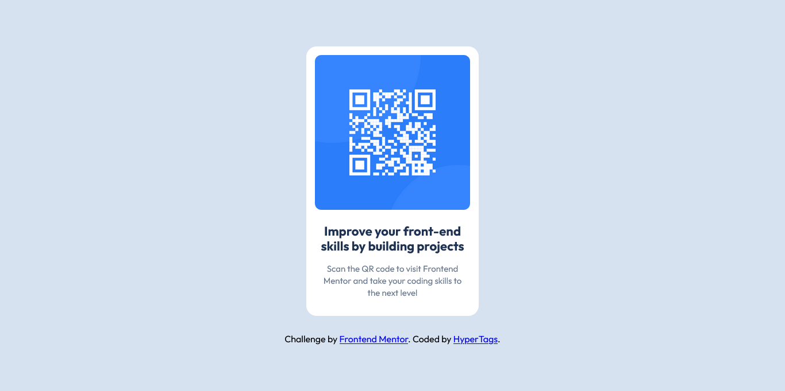

# Frontend Mentor - QR code component solution

This is a solution to the [QR code component challenge on Frontend Mentor](https://www.frontendmentor.io/challenges/qr-code-component-iux_sIO_H). Frontend Mentor challenges help you improve your coding skills by building realistic projects. 

## Table of contents

- [Overview](#overview)
  - [Screenshot](#screenshot)
  - [Links](#links)
- [My process](#my-process)
  - [Built with](#built-with)
  - [What I learned](#what-i-learned)
  - [Continued development](#continued-development)
  - [Useful resources](#useful-resources)
- [Author](#author)
- [Acknowledgments](#acknowledgments)


## Overview

### Screenshot



### Links

- Solution URL: [frontend mentor](https://www.frontendmentor.io/solutions/qr-code-component--pELIpnmbT)
- Live Site URL: [GitHub pages](https://hypertags.github.io/qr-code-component-fm/)

## My process

### Built with

- Semantic HTML5 markup
- CSS custom properties
- Flexbox
- CSS Grid
- Mobile-first workflow

### What I learned

I learned how to add a custom self-hosted font to my website using @fontface. The syntax is like this;

````css
    @font-face {
      font-family: OutfitBold;
      src: url("font/Outfit-Bold.ttf")format("truetype");
      font-weight: 700;
      font-style: normal;
      font-display: swap;
    }
````

### Continued development

- [Media Queries] - I encountered challenges working with media queries to make the website responsible. I seek to perfect it before the next challenge.

- [Flexbox] - I was cool with flexbox but I want to continue and perfect myself in using it.

### Useful resources

- [How to Center ANYTHING in CSS](https://www.youtube.com/elite-tech-club) - This helped me with positioning the card at the center of the viewport. I really liked the explanation and the various other ways to centering items it provided and will use it going forward.
- [How to Import New Fonts in HTML and CSS (Local Fonts & Google Fonts)](https://www.youtube.com/code-&-deploy) - This video helped me with adding the Outfit font to my project. It was very helpful.
- [Media Query in CSS [Easiest Way] How To Write Media Queries](https://www.youtube.com/code-bless-you) - This video helped me with writing media query to make the website responsive.


## Author

- GitHub - [@HyperTags](https://github.com/HyperTags)
- Frontend Mentor - [@HyperTags](https://www.frontendmentor.io/profile/HyperTags)
- LinkedIn - [David Addo](https://linkedIn.com/in/david-addo-6ba707350)


## Acknowledgments

I would like to say a very BIG thank you to Frontend Mentor for providing us an opportunity to learn and build real projects. I would also like to thank myself for being able to complete this project, glory be to God Almighty for His help. I want appreciate Fabian at Coding2Go for his inspiration and consistent update on frontend development. Thank you to you all!
